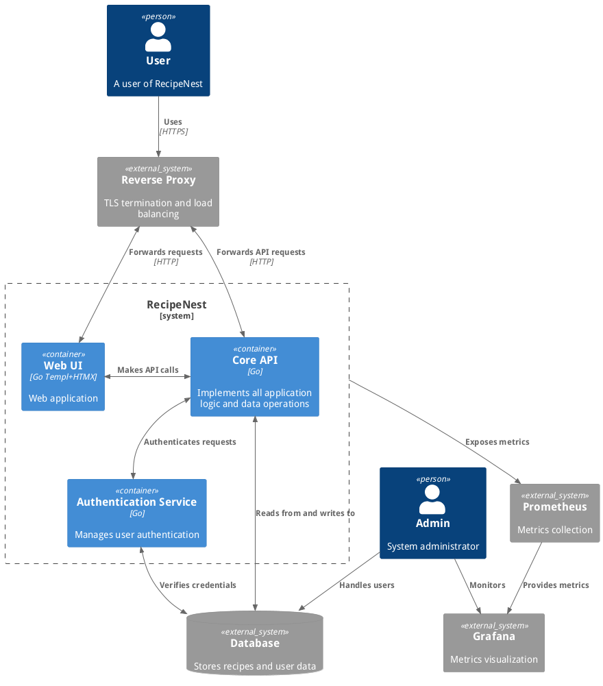
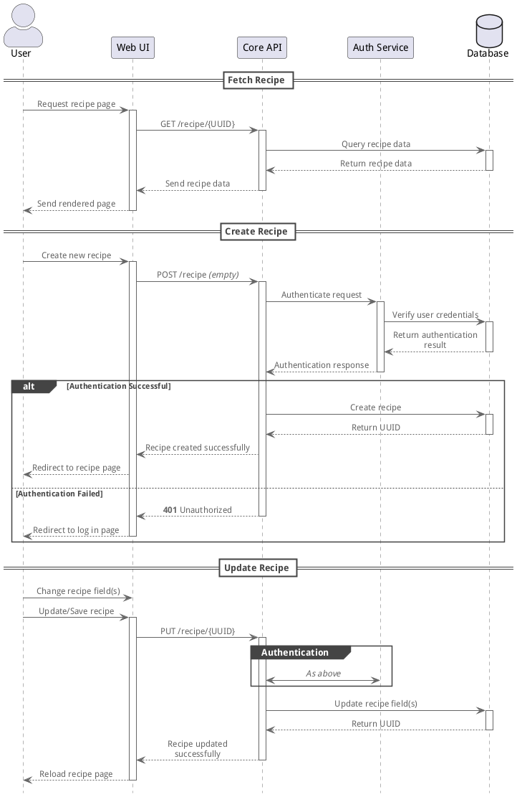

# RecipeBank
A recipe management system with AI-powered features.

## System Architecture

## Sequences

## Ideas
- Plan your upcoming dishes (could include AI to help based on cost, diet, etc.)
  - Generate grocery lists (could use AI to group items)

# TODO
- Docker deployment
- Collect metrics with Prometheus (and show in Grafana)
- Collect logs with Loki (and Promtail)

## Auth
- Set up

## API
- Use auth

## UI
- Edit recipes
- Better looking UI
